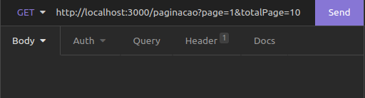

# Desafio

## Instalando Dependências

Na raiz do projeto:
```bash
npm install
``` 
## Executando aplicação

* Para rodar o projeto:

  ```
  npm start
  ```
  
* Exemplo do end-point da requisição rodando localmente:

  

## Executando Testes

* Para rodar todos os testes:

    Com o npm start desativado.
  ```
    npm test
  ```
